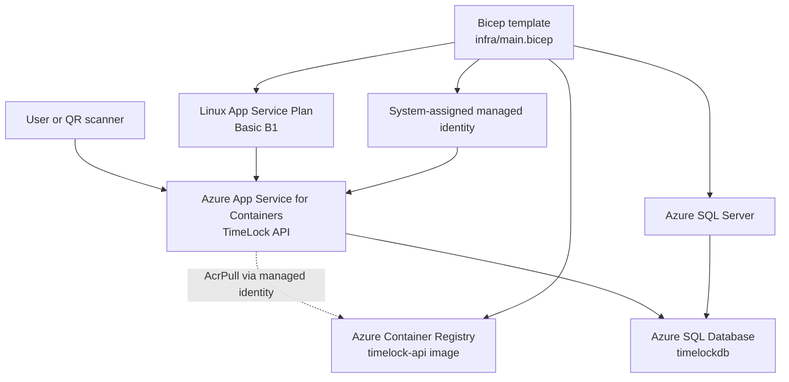
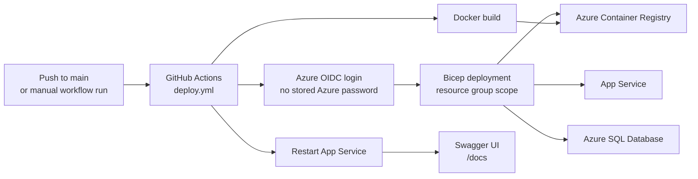

# TimeLock API

TimeLock API is a containerized FastAPI project for digital time capsules. A user creates a capsule with a title, content, and UTC unlock date. The API returns a public open link and a QR endpoint. Before the unlock date, the public link says the capsule is locked. After the unlock date, it reveals the message.

The repository includes Azure infrastructure as code with Bicep, a Dockerized API, GitHub Actions deployment, and an OpenAPI specification that can be imported into Swagger tools.

## Architecture

| Layer | Azure service |
| --- | --- |
| Database | Azure SQL Database |
| Container image | Azure Container Registry |
| Backend hosting | App Service for Containers |
| Infrastructure as Code | Bicep |
| API documentation | Swagger/OpenAPI |

### Azure resource topology



### GitHub deployment flow



## API endpoints

| Method | Path | Purpose |
| --- | --- | --- |
| GET | `/health` | Check API and database connectivity |
| POST | `/capsules` | Create a time capsule |
| GET | `/capsules` | List active capsules |
| GET | `/capsules/{id}` | Read one capsule |
| PUT | `/capsules/{id}` | Update one capsule |
| DELETE | `/capsules/{id}` | Soft-delete one capsule |
| GET | `/capsules/{id}/qr` | Return a PNG QR code for the public open URL |
| GET | `/open/{publicCode}` | Public locked/unlocked capsule view |

The repository includes [openapi.yaml](./openapi.yaml), so you can paste the full OpenAPI specification directly into Swagger Editor.

## Data model

The app creates this table automatically on startup:

```sql
CREATE TABLE Capsules (
    Id INT IDENTITY PRIMARY KEY,
    Title NVARCHAR(120) NOT NULL,
    Content NVARCHAR(MAX) NOT NULL,
    UnlockAt DATETIME2 NOT NULL,
    PublicCode NVARCHAR(32) NOT NULL UNIQUE,
    IsDeleted BIT NOT NULL DEFAULT 0,
    CreatedAt DATETIME2 NOT NULL
);
```

## Local development

Create a virtual environment and run the API on Linux, macOS, or WSL:

```bash
python3 -m venv .venv
source .venv/bin/activate
pip install -r src/requirements.txt
uvicorn src.main:app --reload
```

If no database environment variables are provided, the app uses a local SQLite file named `timelock.db`. Swagger will be available at:

```txt
http://127.0.0.1:8000/docs
```

Create a locked capsule:

```bash
curl -X POST http://127.0.0.1:8000/capsules \
  -H "Content-Type: application/json" \
  -d '{
    "title": "Message for my future self",
    "content": "If you are reading this, keep building.",
    "unlockAt": "2026-05-10T00:00:00Z"
  }'
```

Open a capsule:

```bash
curl http://127.0.0.1:8000/open/K7F9A2QX
```

## Docker

Build and run the container locally:

```bash
docker build -t timelock-api:latest .
docker run --rm -p 8000:8000 timelock-api:latest
```

## Deploy to Azure with Bicep

The repository includes a GitHub Actions workflow at [.github/workflows/deploy.yml](./.github/workflows/deploy.yml). It deploys the Bicep template, builds the Docker image, pushes it to Azure Container Registry, restarts App Service, and verifies `/health`.

Required GitHub repository variables:

| Variable | Purpose |
| --- | --- |
| `AZURE_CLIENT_ID` | Azure application/client ID used for OIDC login |
| `AZURE_TENANT_ID` | Azure tenant ID |
| `AZURE_SUBSCRIPTION_ID` | Azure subscription ID |
| `AZURE_RESOURCE_GROUP` | Target resource group |
| `AZURE_LOCATION` | Azure region, for example `eastus` |
| `SQL_ADMIN_USER` | Azure SQL administrator username |

Required GitHub repository secret:

| Secret | Purpose |
| --- | --- |
| `SQL_ADMIN_PASSWORD` | Azure SQL administrator password |

The workflow runs automatically on pushes to `main` that change the API, Dockerfile, infrastructure, or workflow. It can also be started manually from the GitHub Actions tab.

## Manual Azure deployment

Create a resource group:

```bash
az group create \
  --name rg-timelock-api \
  --location eastus
```

Deploy the infrastructure:

```bash
DEPLOYMENT_NAME=timelock-infra

az deployment group create \
  --name "$DEPLOYMENT_NAME" \
  --resource-group rg-timelock-api \
  --template-file infra/main.bicep \
  --parameters sqlAdminPassword='Use-A-Strong-Password-123!'
```

Capture the deployment outputs:

```bash
ACR_NAME=$(az deployment group show \
  --resource-group rg-timelock-api \
  --name "$DEPLOYMENT_NAME" \
  --query properties.outputs.acrName.value \
  -o tsv)

ACR_LOGIN_SERVER=$(az deployment group show \
  --resource-group rg-timelock-api \
  --name "$DEPLOYMENT_NAME" \
  --query properties.outputs.acrLoginServer.value \
  -o tsv)

APP_NAME=$(az deployment group show \
  --resource-group rg-timelock-api \
  --name "$DEPLOYMENT_NAME" \
  --query properties.outputs.appName.value \
  -o tsv)
```

Build and push the image:

```bash
az acr login --name "$ACR_NAME"
docker build -t timelock-api:latest .
docker tag timelock-api:latest "$ACR_LOGIN_SERVER/timelock-api:latest"
docker push "$ACR_LOGIN_SERVER/timelock-api:latest"
```

Restart App Service after the first image push:

```bash
az webapp restart \
  --name "$APP_NAME" \
  --resource-group rg-timelock-api
```

Open Swagger:

```bash
APP_URL=$(az deployment group show \
  --resource-group rg-timelock-api \
  --name "$DEPLOYMENT_NAME" \
  --query properties.outputs.appUrl.value \
  -o tsv)

echo "$APP_URL/docs"
```

## Quick verification flow

1. Review `infra/main.bicep`.
2. Deploy the resource group infrastructure.
3. Build and push the Docker image to ACR.
4. Open Swagger at `/docs`.
5. Create a capsule with a future unlock date.
6. Copy the `openUrl` and show that it is locked.
7. Create another capsule with a past unlock date.
8. Open that capsule and show that it is unlocked.
9. Open `/capsules/{id}/qr` and scan the QR code.

## Environment variables

| Variable | Purpose |
| --- | --- |
| `DB_SERVER` | Azure SQL server host |
| `DB_NAME` | Azure SQL database name |
| `DB_USER` | Azure SQL username |
| `DB_PASSWORD` | Azure SQL password |
| `DB_DRIVER` | Optional ODBC driver name, defaults to `ODBC Driver 18 for SQL Server` |
| `DATABASE_URL` | Optional full SQLAlchemy URL. If set, it overrides the individual database variables |
| `PUBLIC_BASE_URL` | Optional public URL used to generate open links and QR links |

## Notes

The Bicep template disables ACR admin credentials and gives the App Service system-assigned managed identity the `AcrPull` role. This keeps container pull access inside Azure without storing registry passwords in application settings.
